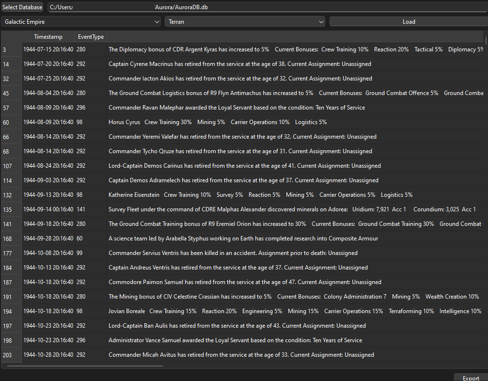

# Aurora Parser

A simple interactive tool to extract your empire's logs from the Aurora database and export them to a variety of formats to use downstream. The tool was originally built to pull game logs as a .csv file to hand off to ChatGPT for creating narratives, but it can be used for a wide variety of uses.

## 🚀 Features

- Interactive menu to select your race (or any race you want to view)
- See your gamelogs directly in the app, with readable timestamps
- Export logs to a variety of formats including csv and json

## 🛠️ Installation

You can download the latest release from [the Releases page on GitHub](https://github.com/ctrenthem159/aurora-parser/releases). Currently the app is available for Windows and Linux.

## 📦 Usage

When the app opens, you can select your `AuroraDB` file that contains your current save. Unless the database structure changes, this app should be compatible with most recent versions of Aurora.

Upon selecting a game database, use the dropdowns to choose your savegame and race, then hit "Load". You can also choose to show/hide NPRs from the race list at any time.

If you want to export your entire game log, use the "Export" button at the bottom. You can save it in a variety of formats including json, csv, and excel.

## 🧪 Development & Testing

Developers and writers looking to contribute should review the [contribution guidelines](CONTRIBUTING.md).

## 🔭 Roadmap

- [/] Viewer for other database areas that users find relevant. (Unless Steve says otherwise, this tool will not allow modifying the database)
  - [x] Commanders
  - [ ] Ships & Fleets
  - [ ] Planets & Systems
  - [ ] Minerals
  - [ ] Theme Viewers
- [ ] Enable live-view mode
- [ ] Re-write the CLI to match the functionality of the GUI, and make it more suitable for testing/automation
- [ ] Documentation
- [ ] Return to 100% test coverage

## 📄 Legal

[PolyForm Noncommercial license](LICENSE)

[AI Usage Disclosure](DISCLOSURE.md)

## 🧠 Credits

Created and maintained by @ctrenthem159
